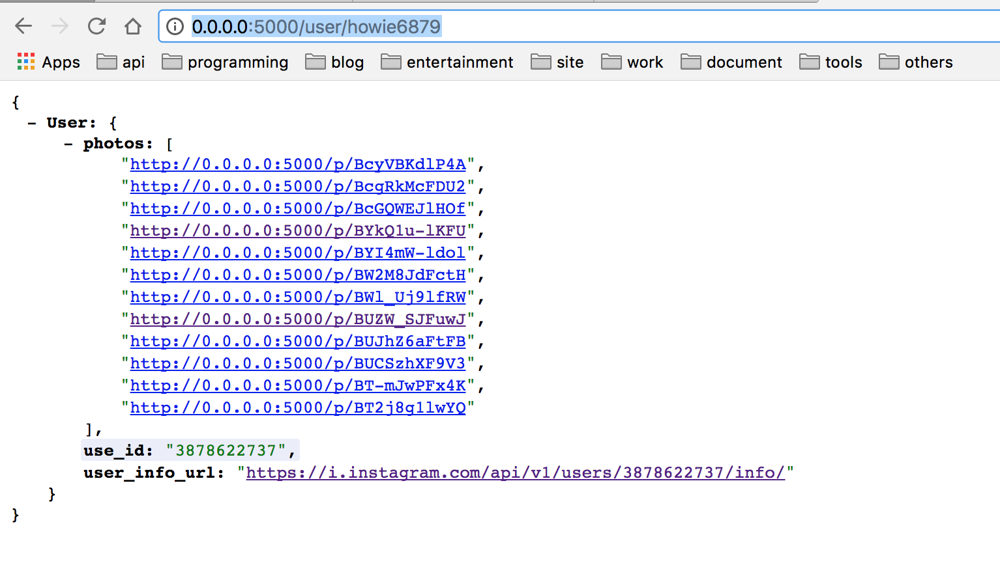
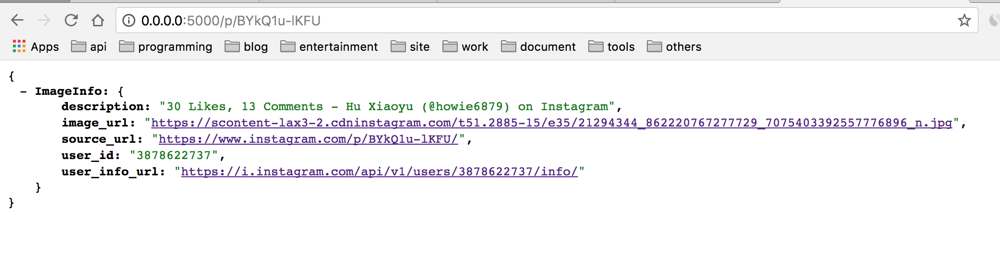

## toapi-instagram

### What is toapi-instagram?

This project uses [Toapi](https://github.com/gaojiuli/toapi) to build a friendly and robust API from instagram.


``` shell

# or git clone https://github.com/toapi/toapi-instagram
toapi new toapi/toapi-instagram
cd toapi-instagram

```

Please start Redis before running this script: `python wsgi.py`

Then, everything is done, the following content will show on screen:


### Usage:

Once the server is started, you can get JSON data from toapi-instagram, now toapi-instagram can:

- user_info
- media_info

Visit `http://0.0.0.0:5000/items/`





### Deploy:

We recommend that you use Caddy(Nginx) + Gunicorn
